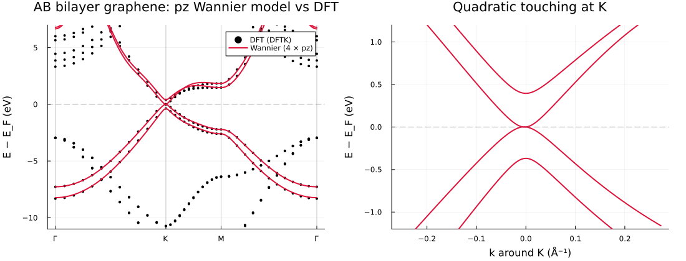
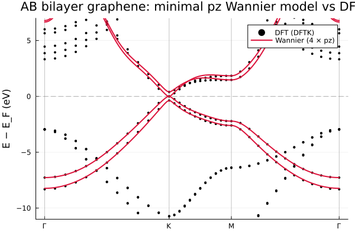
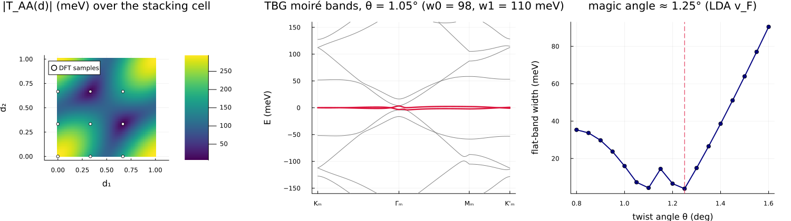

# Examples

Ten runnable scripts under `examples/`, each printing its result next to the corresponding
reference number. Run from the repository root, e.g.
`julia --project=. examples/01_gaas_localization.jl`. Examples 06–09 additionally need
`pkg> add DFTK Plots` (a separate environment with both is fine).

| Script | System | What it shows |
|--------|--------|---------------|
| `01_gaas_localization.jl` | GaAs, 4 → 4 | Maximal localisation; centres and spread vs the reference |
| `02_diamond_interpolation.jl` | diamond, 4 → 4 | Localisation + band interpolation along L–Γ–X–K–Γ |
| `03_silicon_disentanglement.jl` | silicon, 12 → 8 | Disentanglement with outer + frozen windows; the Ω_I trace |
| `04_native_api.jl` | — | The keyword-first Julia API without any `.win` |
| `05_berry_ahc.jl` | bcc Fe (SOC) | Berry curvature + AHC from a checkpoint, digit-for-digit vs `postw90.x` |
| `06_dftk_end_to_end.jl` | silicon | **All-Julia DFT → Wannier**: a DFTK SCF handed over in memory |
| `07_dftk_scdm_minimal.jl` | silicon | **Minimal input**: SCDM projections — `num_wann` is the only Wannier-specific input |
| `08_dftk_bilayer_graphene.jl` | AB bilayer graphene | pz Wannier model from a DFTK slab (ortho-atomic projections + PDWF freezing); Bernal band structure |
| `08_dftk_bilayer_graphene_minimal.jl` | AB bilayer graphene | The lean companion: same model in less code, plus a `scdm_auto` diagnostic showing why energy-only SCDM cannot replace the pz character here |
| `09_tbg_local_stacking.jl` | twisted bilayer graphene | **Magic-angle physics from first principles** via the local-stacking approximation |

## Bilayer graphene (example 08)

A DFTK slab calculation is wannierised to four pz functions using projectability
disentanglement (energy windows would catch the slab's vacuum states). The Wannier bands
track the DFT π manifold exactly; the K-point zoom shows the Bernal hallmarks — quadratic
band touching at E_F and the interlayer splitting γ₁ ≈ 0.38 eV:

### How minimal can the input be? (example 08, minimal)

The lean companion `08_dftk_bilayer_graphene_minimal.jl` reproduces the same pz model in far
less code, and answers a natural question: can graphene's π bands be wannierised from an
energy-only recipe — SCDM-erfc with its `(μ, σ)` fitted automatically by
[`scdm_auto`](@ref) (the Vitale et al. protocol) — so that `num_wann` is essentially the only
input, as in example 07?

For graphene the answer is **no, and instructively so**. The π and σ manifolds overlap in
energy, so no energy window or energy-based smearing can separate them: `scdm_auto` reports a
large fit residual (`rms`) because the pz projectability is *band-pass* in energy, not the
monotonic step an erfc describes. The pz **character** is therefore an irreducible physical
input, and projectability disentanglement (PDWF) is the minimal reliable recipe — what got
leaner is the code, not the specification. `scdm_auto` is the right tool for an entangled but
energy-*separable* manifold (a transition-metal d-manifold, the Vitale tungsten case); this
example is the honest counterexample that maps its boundary.

The lean model reproduces the full example-08 result — Ω = 6.75 Ų, two pz functions per
layer — from one figure's worth of code:

## Magic-angle TBG (example 09)

Nine DFTK calculations of the *untwisted* bilayer at different stacking shifts feed the
local-stacking approximation: the interlayer Dirac-point coupling T(d) is Fourier-analysed
over the stacking cell (the C₃ trio of harmonics comes out degenerate to machine precision —
a built-in self-test) to give first-principles Bistritzer–MacDonald parameters
**w₀ = 98 meV, w₁ = 110 meV**, ħv_F = 5.26 eV·Å. The continuum model then produces the moiré
flat bands and the magic-angle dip (at 1.25° for the LDA velocity; the experimental 1.05–1.1°
corresponds to the ~10% larger GW velocity):

The DFT sweep is cached (`examples/output/09_tbg_dft_cache.jls`), so re-running the analysis
is instant; delete the cache to recompute.
